<a href="https://fahadshaikh.net">
  
</a>

  
  
  
  



## Featured builds

  <a href="https://github.com/FahadNafeesAhmed/adaptive-neural-facial-deformer"></a>
  <a href="https://github.com/FahadNafeesAhmed/periscope"></a>
  <a href="https://github.com/FahadNafeesAhmed/Crucible"></a>
  <a href="https://github.com/FahadNafeesAhmed/redcell"></a>
  <a href="https://github.com/FahadNafeesAhmed/-FIAB-Failure-Injection-Agent-Benchmark-"></a>
  <a href="https://github.com/FahadNafeesAhmed/sentinel-kyc-research"></a>

<b>How Crucible teaches itself</b>

 

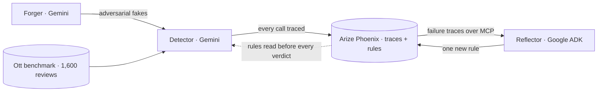

## Inside the flagship



## Stack

## Activity

  
  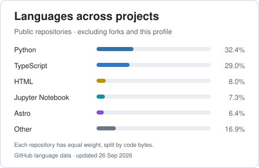


<picture>
  <source media="(prefers-color-scheme: dark)" srcset="https://raw.githubusercontent.com/FahadNafeesAhmed/FahadNafeesAhmed/output/snake-dark.svg">
  
</picture>

## More builds

| Project | What it does | Built with |
|---|---|---|
| [NeuralPilot](https://github.com/FahadNafeesAhmed/NeuralPilot) | Computer-use agent: Gemini plans each step, LocateAnything-3B finds the exact pixel to click | Python · Gemini · PyAutoGUI |
| [Aran](https://github.com/FahadNafeesAhmed/waltwise) | Drop in a transformer datasheet PDF, get an NEC 450.3 audit and a live wiring schematic | Next.js · Claude · React Flow |
| [Pain-point miner](https://github.com/FahadNafeesAhmed/redditextractor) | Evidence-first research: a problem counts only after 3 authors in 2 threads report it | Python · local LLM |
| [Coin Catcher](https://github.com/FahadNafeesAhmed/fintech-budget-splitter) | Full-stack Dart game and budget splitter on DartStream, with a [live demo](https://sample-app-fahad-ahmed.web.app) | Dart · Flutter · Firebase |
| [SmartHedge](https://github.com/FahadNafeesAhmed/smarthedge-app) | Hedge calculator and basis monitor for refined oil products | React · Vite |
| [HotoDog Detection](https://github.com/FahadNafeesAhmed/HotoDog-Detection) | Hot dog / not hot dog, done properly: a YOLO detector trained end to end | PyTorch · Ultralytics · OpenCV |

<a href="https://fahadshaikh.net">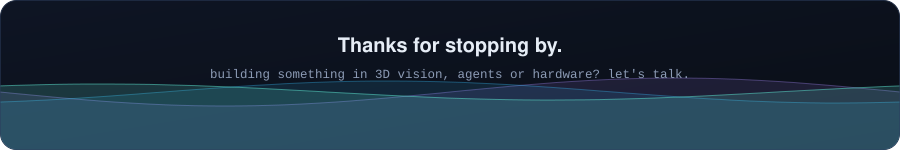</a>

Stats and the skyline refresh daily through GitHub Actions ([`scripts/build_stats.py`](scripts/build_stats.py)).
